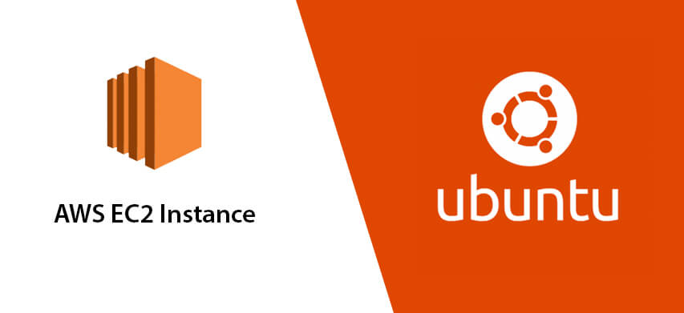
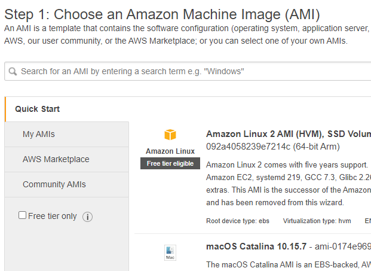
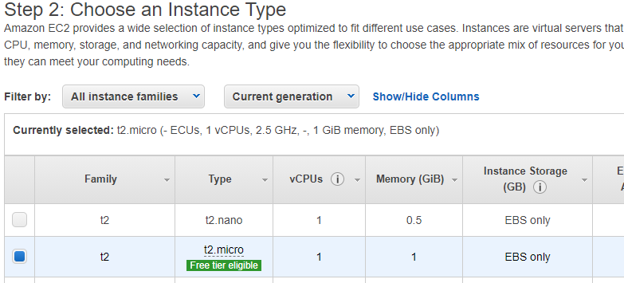
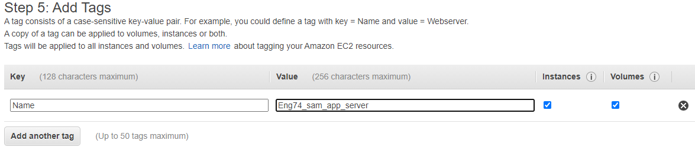
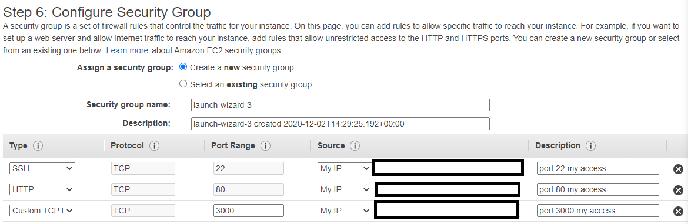
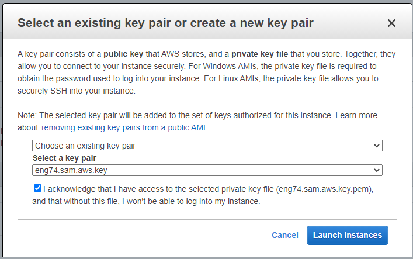
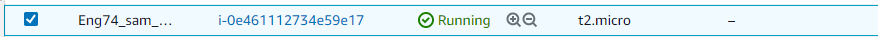
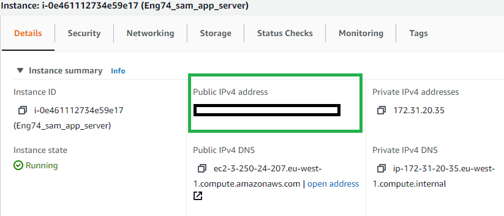

# AWS EC2 Server

This Read me will walk through the steps of setting up an EC2 instance in AWS. No prerequisites are required other than an account with AWS.



# Instructions
## Launch Instance
- Log in, and on the drop down make sure you are in the area you want your cloud server to run.
- Click EC2 and Launch an instance which should take you to this page.



## Step 1
- Choose the OS you want to run
- We will choose the free tier Ubuntu 18

## Step 2
- Choosing the instance type depends what you want to do on this server however we will choose the free 1CPU and 1GB ram.



## Step 3
- Configureing the instance details means we choose the network and the subnet.
- Most of the settings we can keep as default for now.
- The network I am using is the DevOpsStudents default
- Auto assign public IP is set to enabled
- The other settings are all default values

## Step 4
- Add Storage can be kept as its default values

## Step 5
- Add a tag, so we can name our instance, and put the key as Name and the value as a logical server name that follows the naming convention of your company.



## Step 6
- We need to add a security group, so we can choose who can access our server instance.
- This should be named appropriately if not made already, else choose your security group
- I added a port to access the server with an ssh key
- I also added a port to access with my ip address in the URL
- Finally I added a custom tcp on port 3000, which is the development port of our app.



## Step 7
- This just shows a summary of your server settings so make sure they ate correct.
- Then click launch
- It should ask you to select an ssh key. If you dont have one, click create a new key pair and name it appropriately, then save it in a safe place once you launch instances.
- I have a key pair so will select it and launch.



- If successful it should show when you view the instances.



# Entering virtual machine
- Enter the folder you saved your ssh key
- Enter the command
```bash
ssh -i <name of key> ubuntu@<your Public IP4 address>
```
- Your public ip address should be found in the detauls section on your aws instance.



- Type yes in the terminal to continue connecting and you should enter the terminal of your EC2.