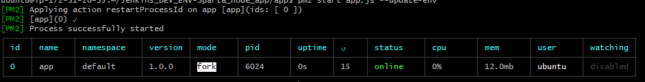

# AWS EC2 Server

This Read me will walk through the steps of setting up an EC2 instance in AWS. No prerequisites are required other than an account with AWS.


## What is the cloud?
The cloud is a metaphor for a global network of remote servers that operates as a single ecosystem, commonly associated with the internet.
### Benefits of the Cloud
- **No capital costs** - There are high capital costs associated with servers which can be avoided by using cloud services like AWS.
- **No maintainance costs** - The physical servers are located in data centers and therefore the cost of maintainance as well as repairs is offset to the owner of the data center.
- **Scalability** - Pay for what you will use, allows you to scale your infrastructure based on what you need.
- **Security** - The data center owner is responsible for physical security of the servers therefore you don't have to hire security guards to protect your own servers.

## AWS and EC2
Amazon web services is a cloud platform which provides on demand cloud computing and other features. It offers Platform as a service and Infrastructure as a service (PaaS and Iaas).
EC2 is a feature of AWS that allows access to a scalable virtual cluster of computors. It stands for amazon elastic compute cloud.

## Security Group(SG)
This acts as a virtual firewall for your EC2 instances to control incoming and outgoin traffic.

- To open a port  to your Ip you can add security groups when creating your aws instance and specify which ports you want to point towards your IP.
- You shouldnt have port 22 open to all ips because its the port used for your ssh and is responsible for secure logins, file transfers and port forwarding. Giving everyone access to this port could compimise your systems security and allow outside access to your machine.

## SSH keys
- You should keep your SSH keys in a secure place that follows these recommendations:
  - offline
  - Away from any data its related to 
  - Inside a hidden folder

# Instructions
## Launch Instance
- Log in, and on the drop down make sure you are in the area you want your cloud server to run.
- Click EC2 and Launch an instance which should take you to this page.


## Step 1
- Choose the OS you want to run
- We will choose the free tier Ubuntu 18

## Step 2
- Choosing the instance type depends what you want to do on this server however we will choose the free 1CPU and 1GB ram.


## Step 3
- Configuring the instance details means we choose the network and the subnet.
- Most of the settings we can keep as default for now.
- The network I am using is the DevOpsStudents default
- Auto assign public IP is set to enabled
- The other settings are all default values

## Step 4
- Add Storage can be kept as its default values

## Step 5
- Add a tag, so we can name our instance, and put the key as Name and the value as a logical server name that follows the naming convention of your company.


## Step 6
- We need to add a security group, so we can choose who can access our server instance.
- This should be named appropriately if not made already, else choose your security group
- I added a port to access the server with an ssh key
- I also added a port to access with my ip address in the URL
- Finally I added a custom tcp on port 3000, which is the development port of our app.


## Step 7
- This just shows a summary of your server settings so make sure they ate correct.
- Then click launch
- It should ask you to select an ssh key. If you dont have one, click create a new key pair and name it appropriately, then save it in a safe place once you launch instances.
- I have a key pair so will select it and launch.


- If successful it should show when you view the instances.


# Entering virtual machine
- Enter the folder you saved your ssh key
- Enter the command
```bash
ssh -i <name of key> ubuntu@<your Public IP4 address>
```
- Your public ip address should be found in the detauls section on your aws instance.


- Type yes in the terminal to continue connecting and you should enter the terminal of your EC2.


# Getting our node app into the server
- Adding the app to our server can be done with this command from an appropriate directory
```bash
scp -i ~/.ssh/eng74samawskey.pem -rp Jenkins_DEV_ENV-Sparta_node_app/app ubuntu@54.154.137.16:~/
```
- Make sure the node modules folder is deleted other wise it will take too long to copy over.

- Add both the provision files to the server aswell
```bash
scp -i ~/.ssh/eng74samawskey.pem -rp Jenkins_DEV_ENV-Sparta_node_app/environment/ ubuntu@54.154.137.16:~/
```
- We can now need to enter the vm

### dos2unix
- I made my provision files in windows so will need to convert them to unix files before running them
- This can be done with the `dos2unix` command
```bash
sudo apt-get update -y
sudo apt-get install -y dos2unix
```
- Then convert both the provision files
```bash
dos2unix environment/app/provision.sh environment/db/provision.sh
```
- Just a warning that the paths of the provisions need to be double checked
### Running the db
- `cd environment/db` 
- make sure `sudo apt update` first
- and run `./provision.sh` to start the db

### Running the app
- `cd app/` (this isnt in environment this is in the main folder)
- ls should show you the app.js file
- if so you can run the provision.sh file from here using
```bash
./../environment/app/provision.sh 
```


## Debugging
- For some reason this time round my app wasn't running.
- I doubled checked to see if it was even running on my server with
```bash
curl <privateip>:3000
```
- To fix this i killed pm2 `pm2 kill` and then ran `npm install` and `npm start` from the app folder.


- On the `sudo systemctl status nginx.service` command it had the error message 'failed to parse pid from file'
- This is a well known bug and can be fixed with these commands from your home directory
```bash
mkdir /etc/systemd/system/nginx.service.d
printf "[Service]\nExecStartPost=/bin/sleep 0.1\n" > override.conf
sudo cp override.conf /etc/systemd/system/nginx.service.d/
systemctl daemon-reload
systemctl restart nginx 
```
